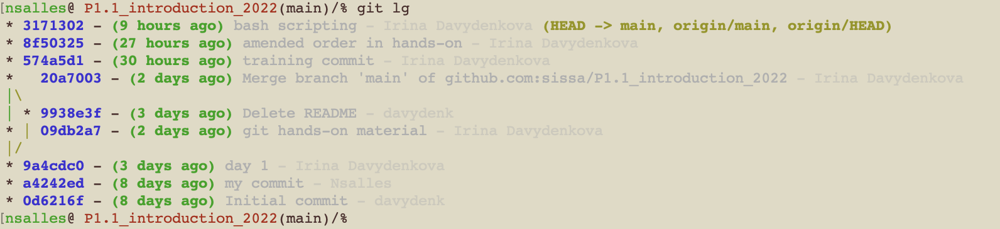

[reference material](https://git-scm.com/book/en/v2)

Since software management is not officially part of this course, we will only cover the very starting basics of using git, just enough to be comfortable with getting your course materials from github and saving your homework.


### Why use git?

 

### What is git?

Git is a free and open source distributed version control system designed to handle everything from small to very large projects with speed and efficiency.

### What is github?

GitHub is an Internet hosting service for software development and version control using Git.

 

###  Let's start! Local software:

make sure that you have `git` installed.

initialize it (or it will complain the first time you do anything):

`git config --global user.name "Whatever Name"`

`git config --global user.email whatever@whatever`


### Remote: github

It's not a good idea to download the `.zip` with the new material every day. Let's learn how to get it to your computer properly.

From the email instructions, you should have already cloned the repository.

Technically, since the course resopitory is public, you don't need a github account to clone it. If you click the green "code" button and copy the `https` link, you can clone without any account. (I gave you the non-https instructions so that you could test the ssh keys.) 

```
git clone THE_LINK_YOU_COPIED
```


Every day before the lecture (or when I tell you that I've updated the repository), you can do

```
git pull origin main
```

to update your folder. 

*Actually, .ipnb files are not really suited to be tracked with git as they are not "pure code". To avoid confusion and conflicts with the original files, I suggest to make a copy of each Lecture/Exercises notebooks and work in them, not the original ones.*


Let's hope that everyone already did the next steps for the passwordless access.

#### Passwordless access


Let's follow [instructions on github](https://docs.github.com/en/authentication/connecting-to-github-with-ssh/checking-for-existing-ssh-keys).

#### Forks

Make sure you are logged in to github and click on the "fork" button.

Go to your fork repository, copy the `ssh` link, then do (replace SOME_FORK_NAME with something, I usually call it "mine" for my forks)

```
git remote add SOME_FORK_NAME SSH_LINK_TO_YOUR_FORK
```

Do 

```
git remote -v
```

You should see 4 lines now.

Create a folder for your homework now, put a copy of a Lecture1 file there.

Do

```
git status
```

It should show your file as "untracked". Let's tell git to track it, there is an `add` command for that.

```
git add YOUR_FILE
```

Now you need to "commit" the changes:

```
git commit -m "USEFUL MESSAGE"
```


`git push SHORT_NAME_YOU_CHOSE_FOR_YOUR_FORK_REMOTE main`

Check online if the changes got uploaded.


### Fun picture


### Gitignore


If you are sure that your `.gitignore` is good, you can just do 

```
git add -A
```

instead of adding files manually. Sooner of later you will push some trash like this, so only do it on your own repositories or if there are way too many files to add.


### Bonus - Now let's make a nice bash prompt

https://github.com/magicmonty/bash-git-prompt


## A little bit more info for those who want to become programmers one day:

### Create a branch

`git checkout -b development`

edit your text file, add and commit

`git push mine development`

go to github and you will see a "create a pull request" (that's how things should get to `main` in real repositories)

`git checkout main`

`git pull mine main` (to update main after github pull request has been merged)

### Merging manually

`git checkout development`

`git checkout -b new_branch`

edit the file again, add, commit, push to new_branch, switch back to development

`git merge new_branch`

check your text file

### Let's create conflict

edit the file in development, add, commit, push

edit the file in new_branch, add, commit, push

now try, while being in new_branch,

`git pull mine development`

What happens?

### Make your own repository

Since our repository is public, so are your forks. If you want your homework to not be accesible by anyone on the internet, you can make a separate private repository and keep your things there. Actually, it's a good idea to keep all your code for any projects backed up in some github repository.

Just go to github and follow visual instructions to create a new repository (choose "with README"), then 

`git clone YOUR_REPOSITORY`.


add some text file to it

`git push origin main` (pushing to main is actually a bad practice - only for "trash/back_up repositories" and learning purposes, but we are doing an introduction, so it's ok)

Remember that whatever you cloned becomes "origin".

-----------------------------------------------------------
## More extra info for your own reading

### Logs/history

Git provides tools to navigate and understand the history of a project. One of the most used tools for this purpose is `git log`.

To see the commit history:

```bash
git log
```

or, to have it more readable:

```
git log --oneline
```

#### Nice looking log

You can customise your `git log` command thanks to many options it has.
To avoid rewriting the list of options every time, you can create an alias in your `~/.gitconfig` file.
Here is an example you can find on the internet:
```
[alias]
	lg = log --graph --abbrev-commit --decorate --format=format:'%C(bold blue)%h%C(reset) - %C(bold green)(%ar)%C(reset) %C(white)%s%C(reset) %C(dim white)- %an%C(reset)%C(bold yellow)%d%C(reset)' --all
``` 
The result should look like this:



### Creating branches from the old commits

Sometimes might want to return to the past and see how things could have played differently. With git you can!

Just do 

```
git checkout -b time_travel_branch <commit-hash>
```

This will also allow you to do "correct" pull requests between forks.


### When you messed up

#### Using git revert 

The "git revert" command creates a new commit that undoes the changes made in the unwanted commit. 

```bash
git revert <commit-hash>
```

(you get commit hash from the log)

Push the New Reverting Commit:

```bash
git push origin <branch-name>
```

This will keep your history untouched, and also record your reverting things. It's better if you want to avoid confusion, but some people don't like extra records in history and only use "git reset".


# git reset (Use with caution)

The git reset command moves the current branch pointer to the specified commit, essentially discarding commits. This method rewrites commit history, which can be problematic if others are working on the same branch. On the bring side, it has more options.


```bash
git reset --hard HEAD~1
```

This command moves the current branch pointer back by one commit (HEAD~1). If you need to undo multiple commits, replace 1 with the number of commits you want to go back.

Then you need to force push the updated Branch:

```bash
git push origin <branch-name> --force
```

The --force flag forces the push, overriding the changes on the remote with your local changes. Use this with caution, as it can overwrite changes made by others.

There are 3 options you can pass:

 - "--hard" : this will undo the commit and undo any changes you did since last commit
 - "--mixed" (default): will undo the commit and "staging" (i.e. undo "git add"), but leave your working changes
 - "--soft": will only undo the commit, but leave the result of "git add"


### When you messed up so much that the above doesn't help

If you

 - did reset --hard and lost changes that you actually need
 - deleted a branch you need
 - forced pushed something very wrong
 - messed things up while rebasing
 - did something else strange that now looks like you lost data

you cannot use revert or reset because your "git log" doesn't show the true history anymore. But you can get more information from a "private"/local command that is just stored on your computer and records every history change

```
git reflog
```

Here you can see hashes of the lost things and then you can reset or (better, cause you are already too deep into the mess to reset again) create a new branch from it.


As a fun way to understand git, go to [this site](https://learngitbranching.js.org/) and do at least the first 2 "rows" of the puzzles. 

--------------------------------------------------------------------------


## conda

the best (what is "best" is, of course, debatable) way to install Python and manage the environments is using `conda`. You can choose between `anaconda` and `miniconda`, the latter being preferable as it's much smaller (doesn't install much by default).

For windows, look for "anaconda prompt".

Once installed, to make sure you have the latest version, run

```
conda update conda
```

To create an environment, do (we specifically use an older version of python as the bext one had a bug when working with conda and jupyter and the lastest one I didn't yet check):

```
conda create --name my_new_env python=3.11
```

To activate:

```
conda activate my_new_env
```

To check that it worked, type `python`, then try to use it as a calculator, to exit, type `quit()`.

To view all the environments, type:

```
conda env list
```


To install packages (for example, numpy):

```
conda install numpy
```

Sometimes you would need to specify a "channel", but it's usually stated on the pages of the packages you are installing.


Some packages are available in `pip` rather than conda. Install `pip` **INSIDE THE ENVIRONMENT**, do not use the system one (you can check with `which pip` to make sure you have the right one). With the new conda versions, pip is actually already installed by default. It's also worth noting that `pip` is less strict with versions compatibilities which can lead to problems, so I'd recomend to use `conda install` first and then use `pip` if that fails. 

We want to configure Jupyter work with conda, for that I'd recommend to also install it inside the environment. Use the following commands (which you should have done already by email instaustions):

```
conda install -c conda-forge jupyterlab
conda install -c conda-forge nb_conda_kernels
```

The second line is needed so that Jupyter finds things in your environment, not just the system ones.

Then start `jupyter-lab` from the console somewhere in the course folder. We are only doing this because it's easier to show things this way. You should be able to open the lecture file and choose the kernel with the name of your environment.


To see all the packages you have installed inside the environment:

```
conda list
```

To deactivate an environment:

```
conda deactivate
```

Note: If you are on Linux and deal with a lot of non-python scientific packages installed, it might be wise to deactivate conda when not using python as sometimes it messes up the environment in tricky ways.

To delete an environent:

```
conda remove -n ENV_NAME --all
```


